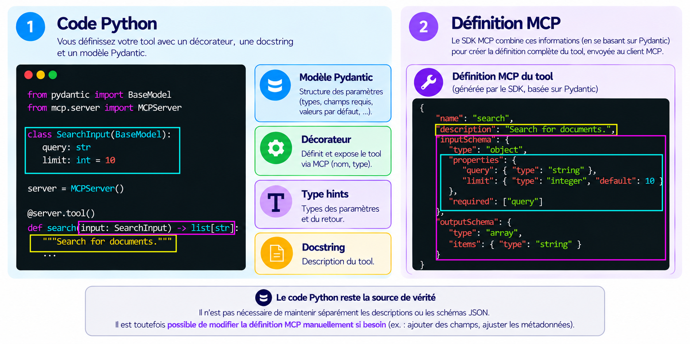
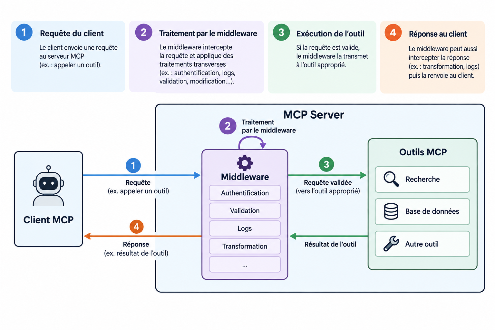
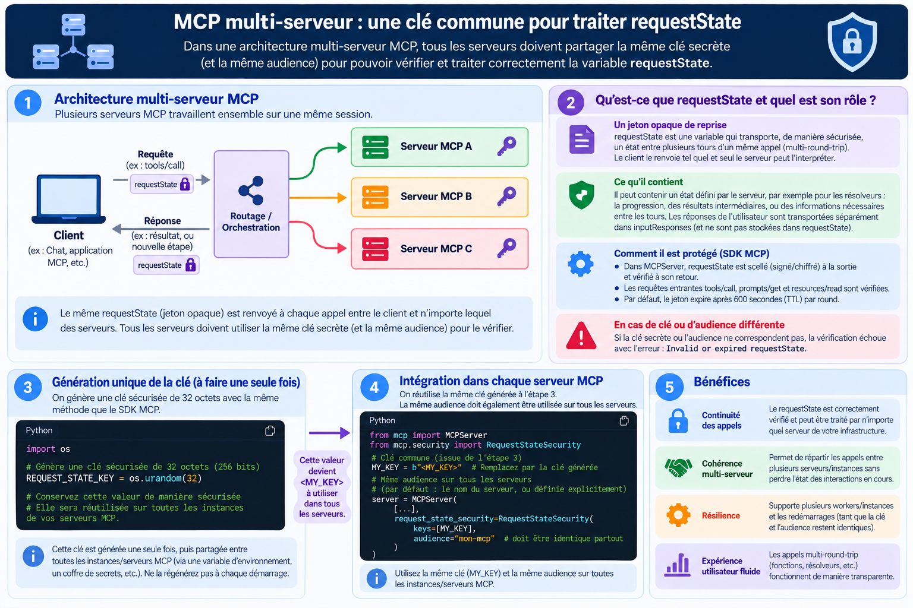

# FO-MCP-PCF-002: MCP - Protocole et concepts fondamentaux: Implémentation

> [!WARNING]
> Le code présenté dans cette section possède **VOLONTAIREMENT** des failles de sécurité et servira de base pour le module `MCP attack`. Il n'a pas vocation à être utilisé pour développer des outils de production.

Ce projet vise à créer un serveur MCP de suivi de commandes simplifié. Il permettra à un utilisateur de connaître l'état de sa commande. À travers ce cas d'usage simplifié, nous explorerons des notions avancées de construction d'un serveur/client MCP.

**Au programme**:

| 🧩 Fonctionnalité                               | 🎯 Description                                                                                                                                |
| :--------------------------------------------- | :------------------------------------------------------------------------------------------------------------------------------------------- |
| 💬 **Interaction avec le client (Elicitation)** | Permet au serveur de **demander des informations complémentaires au client** lorsque cela est nécessaire.                                    |
| 🔔 **Notifications client**                     | **Notifie le client lorsqu’une donnée évolue**, afin de maintenir les informations du serveur MCP synchronisées.                             |
| 🧱 **Description des composantes MCP**          | **Décrit et structure les composantes MCP** pour fournir au LLM les informations nécessaires à leur compréhension et à leur utilisation.     |
| 🛡️ **Contrôle des flux par Middleware**         | Intercepte et contrôle les échanges pour appliquer des règles de **validation, authentification, logging, transformation** ou filtrage.      |
| 🔀 **Approche multi-instances**                 | Permet d'**orchestrer plusieurs serveurs MCP** et de répartir les outils ou ressources selon les besoins.                                    |
| 📊 **Télémétrie**                               | **Collecte des métriques et traces** sur les interactions MCP afin de faciliter l'observabilité, le suivi des performances et le diagnostic. |

## Prérequis

**🚨 Compétences préalables**: Python, programmation asynchrone, notions sur les systèmes distribués

| Étape | Description                   | Commande                                           |
| ----- | ----------------------------- | -------------------------------------------------- |
| 1     | Créer l’environnement virtuel | `python3 -m venv .ai`                              |
| 2     | Activer l’environnement       | `source .ai/bin/activate`                          |
| 3     | Installer les paquets Python  | `pip install mcp[cli] opentelemetry-sdk` |
| 4     | Installer `tcpflow`           | `sudo apt install tcpflow`                         |

| Action                     | Commande                                              |
| -------------------------- | ----------------------------------------------------- |
| Déploiement du serveur MCP | `uvicorn server_mcp:app --port 8000 --host 127.0.0.1` |
| Requête du client MCP      | `python3 client_mcp.py`                               |

> [!IMPORTANT]
> Ce module ne va pas explorer la syntaxe de base du SDK. La suite de ce module nécessite de maîtriser les notions décrites du Get Started officiel (https://py.sdk.modelcontextprotocol.io/get-started/first-steps/). 
> 
> On suppose donc que vous savez déclarer des Tools/Ressources/Prompt via le SDK MCP Python.
> 
> L'objectif est de se concentrer sur les **notions avancées**.

## MCP avancé : serveur HTTP, observabilité et scaling

| Élément                  | Choix                                                              |
| ------------------------ | ------------------------------------------------------------------ |
| 🗓️ **Version MCP**        | `moderne` — **28 juillet 2026**                                    |
| 🌐 **Adresse du serveur** | `http://127.0.0.1:8000`                                            |
| 🐍 **SDK Python**         | [MCP Python SDK officiel](https://py.sdk.modelcontextprotocol.io/) |
| 🏗️ **Approche**           | Utilisation directe du SDK officiel du protocole MCP               |
| 🗄️ **Base de données**    | SQLite — dépendance Python standard `sqlite3`                      |

> [!NOTE]
> Une alternative existe et propose une approche plus haut niveau. Il s'agit du projet `Fastmcp` (https://gofastmcp.com/getting-started/welcome). Ce projet présente une meilleure intégration de dépendances tierces utiles à la production comme l'authentification par Provider (Github, Google...). Cependant, des fonctionnalités avancées ne sont pas encore implémentées comme la gestion des notifications dans la version `2026-07-28`.

**Schéma opérationnel du serveur MCP**:

```text
                    ┌──────────────────────┐
                    │     MCP Server       │
                    │ Enterprise Database  │
                    └──────────┬───────────┘
                               │
              ┌────────────────┼────────────────┐
              │                │                │
              ▼                ▼                ▼
        ┌───────────┐    ┌────────────┐   ┌────────────┐
        │   Tools   │    │ Resources  │   │   Prompt   │
        ├───────────┤    ├────────────┤   ├────────────┤
        │ get_user_ │    │ orders://  │   │ audit_user │
        │ orders    │    │ {name}/    │   │ _orders    │
        │           │    │ count      │   │            │
        │ add_order │    │            │   │            │
        │           │    │            │   │            │
        │ delete_   │    │            │   │            │
        │ order     │    │            │   │            │
        └─────┬─────┘    └──────┬─────┘   └────────────┘
              │                 │
              └────────┬────────┘
                       ▼
              ┌─────────────────┐
              │    SQLite DB    │
              ├─────────────────┤
              │     users       │
              │     orders      │
              └─────────────────┘
```

### Problème n°1: Comment décrire les composantes du serveur MCP ?

Un serveur MCP met à disposition des fonctionnalités à un client mais cela soulève un problème.

> Comment ces fonctionnalités sont décrites et transmises au client pour être interprétées ?

Comme vu dans cette partie du [LEARN](/developpements_outils/mcp_fondations/learn/learn.md#identité-des-toolsressourcesprompts), nous savons que le serveur décrit ses fonctionnalités via des *JSON Schema* retournés lors des requêtes déclaratives (via `tool/list` par exemple). Mais comment réaliser ces *JSON Schema* ?

> Solution: **Pydantic**.

Dans un code Python, *Pydantic* (https://pydantic.dev/) permet de définir, structurer et conditionner les variables. Le SDK utilise ces informations pour remplir automatiquement les *JSON Schema* correspondants.

L'infographie ci-dessous illustre comment les déclarations *Pydantic* sont exploitées.



> [!NOTE]
> La logique est similaire pour les Resources/Prompts mais les paramètres/attributs ne sont pas les mêmes.

### Problème n°2: Comment analyser/filtrer les entrées/sorties d'un serveur MCP avant traitement ?

La mission d'un serveur MCP est de recevoir et traiter des requêtes en provenance d'un client. Cependant, il est possible que le serveur MCP reçoivent des requêtes que **le serveur ne doit pas traiter**. Il peut s'agir de requêtes malveillantes, mal construites ou encore non réalisables... De même, les réponses du serveur MCP peuvent être inadéquates (fuite d'informations, incohérence...).

> Comment contrôler les informations à l'entrée et à la sortie du serveur ?

Afin de contrôler la validité de la requête/réponse en dehors des fonctions de traitement-même, il est souvent préférable de **contrôler ces informations en amont et en aval**. Mais comment faire ?

> Solution: **Middleware**
> 
Un *middleware* est une couche qui **s'intercale entre la réception d'une requête MCP et son traitement** par le serveur (logique similaire lors de la réponse post-traitement). Il permet d'exécuter une logique avant et/ou après l'appel suivant la chaîne de traitement, sans modifier directement les Tools.

Ils sont particulièrement utiles pour **centraliser les besoins récurrents** comme l'authentification et les contrôles de sécurité, plutôt que de répéter cette logique dans chaque Tool.



Dans cet exemple, nous faisons 2 middleware:

* **Logging**: Calculer la durée du traitement de la requête, récupérer la méthode/fonction appelée par le client et le PID du processus du serveur MCP.
* **Filtrage**: Les tools ne peuvent pas faire d'action sur l'utilisateur *Mortarion*.

> [!Note]
> Ce type de logging est déjà réalisé par la télémétrie du SDK. Il s'agit donc d'un doublon. Mais à but pédagogique, nous le conservons.

```text
################
# MIDDLEWARE A #
################

async def get_request_logging(ctx:  ServerRequestContext, call_next: CallNext) -> HandlerResult:
    start = time.perf_counter()
    try:
        return await call_next(ctx)
    finally:
        elapsed_ms = (time.perf_counter() - start) * 1000
        logger.info("%s took %.1f ms", ctx.method, elapsed_ms)

################
# MIDDLEWARE B #
################

async def get_request_control(ctx:  ServerRequestContext, call_next: CallNext) -> HandlerResult:
    logger.info(f"[MCP] PID={os.getpid()} method={ctx.method} function={ctx.params.get("name")}")
    if ctx.method == "tools/call":
        if (await ctx.request.json())["params"]["arguments"].get("name") == "Mortarion":
            logger.warning(f"Unauthorized access to protected customer - Refused request")
            raise MCPError(code=INVALID_PARAMS, message=f"Mortarion is a protected customer ! - Refused request") 
    return await call_next(ctx)

mcp = MCPServer([...])
mcp.middleware.append(get_request_logging)
mcp.middleware.append(get_request_control)
```

| Élément     | Contenu                                             | Sert à                                                          |
| ----------- | --------------------------------------------------- | --------------------------------------------------------------- |
| `ctx`       | **Contexte de la requête MCP courante**             | Lire les informations de la requête et son contexte d'exécution |
| `call_next` | **Fonction permettant de poursuivre le traitement** | Transmettre la requête au middleware/handler suivant            |

`raise MCPError()` permet de soulever une erreur afin de bloquer la requête. Le client reçoit le message d'erreur en réponse à cette requête

`call_next` est la fonction qui permet au middleware de passer la main au traitement suivant. Le résultat de cette fonction signifie que l'ensemble des traitements a été réalisé et que le résultat repasse par le middleware avant de se diriger vers le client.

**Et si il y a plusieurs middleware ?**

```
Requête
  │
  ▼
Middleware A
  │
  │ call_next(ctx)
  ▼
Middleware B
  │
  │ call_next(ctx)
  ▼
Tool
  │
  ▼
Résultat
  │
  ▼
Middleware B
  │
  ▼
Middleware A
  │
  ▼
Réponse
```

Dans le *middleware* A, `await call_next(ctx)` représente l'exécution de tout ce qui se trouve **derrière A, y compris les autres middlewares et finalement le Tool jusqu'au retour à A**.

### Problème n°3: Comment tracer l'activité d'un serveur MCP ?

Comme tout serveur, le suivi de son activité est essentiel pour garantir qu'il reste stable et fiable dans le temps. Pour cela, deux approches sont disponibles: **logs** et **télémétrie**.

Dans le cadre du suivi d'un serveur MCP, les logs et la télémétrie sont complémentaires.

|                 | 📝 **Logs**                                                                                                                        | 📊 **Télémétrie**                                                                                                          |
| --------------- | --------------------------------------------------------------------------------------------------------------------------------- | ------------------------------------------------------------------------------------------------------------------------- |
| **Rôle en MCO** | Diagnostiquer les incidents                                                                                                       | Surveiller l'état et les performances                                                                                     |
| **Objectif**    | Comprendre **ce qui s'est passé**                                                                                                 | Mesurer **comment le service se comporte**                                                                                |
| **Utilité**     | Identifier une erreur, comprendre le contexte d'un `tools/call`, suivre une requête et rechercher la cause d'un dysfonctionnement | Suivre la latence, le taux d'erreur, le volume d'appels et détecter une dégradation avant qu'elle ne devienne un incident |
| **Quand ?**     | Principalement lors d'un incident ou d'un diagnostic                                                                              | En continu, pour la supervision et la détection d'anomalies                                                               |
| **Exemple**     | `ERROR tools/call delete_order failed`                                                                                            | `P95 latency = 850 ms · error rate = 3%`                                                                                  |

La télémétrie permet donc de détecter et suivre les problèmes, tandis que les logs permettent de les comprendre et de les diagnostiquer.

```text
                         MCP SERVER
                             │
              ┌──────────────┴──────────────┐
              │                             │
              ▼                             ▼
        ┌───────────┐                ┌───────────────┐
        │   LOGS    │                │ OPENTELEMETRY │
        └─────┬─────┘                └───────┬───────┘
              │                              │
              ▼                              ▼
       "QUE S'EST-IL                 "COMMENT ÇA
         PASSÉ ?"                     S'EST PASSÉ ?"
              │                              │
              ▼                              ▼
       ┌─────────────┐                ┌──────────────┐
       │ Événements  │                │     Spans    │
       │ Erreurs     │                │ Durée        │
       │ Contexte    │                │ Statut       │
       │ Données     │                │ Trace ID     │
       └─────────────┘                │ Corrélation  │
                                      └──────────────┘

              └──────────────┬──────────────┘
                             ▼
                    OBSERVABILITÉ MCP
```

**OpenTelemetry** (https://opentelemetry.io/) est intégré nativement au SDK pour fournir la tracing/observabilité des échanges MCP. Le SDK installe par défaut un OpenTelemetryMiddleware qui crée un *span* pour chaque message MCP reçu côté serveur.

Il reste à choisir/configurer leur collecte, leur export et leur visualisation/stockage (fichiers, Grafana...).

Dans le cadre de ce module, afin de simplifier les dépendances, nous nous limiterons à stocker les traces dans un fichier texte.

```python
log_file = open("./telemetry.log", "a", encoding="utf-8")
provider = TracerProvider()
provider.add_span_processor(SimpleSpanProcessor(ConsoleSpanExporter(out=log_file)))
trace.set_tracer_provider(provider)
```

> [!NOTE]
> Stocker dans un fichier est **rarement exploitable pour superviser**. Il est souvent préférable d'utiliser des outils de visualisation comme Grafana par exemple. Une gestion plus fine de la télémétrie sera faite dans un module futur.

Pour le logging classique, le SDK repose sur les standards pythoniques, c'est-à-dire utiliser le paquet `logging`.

```python
logger = logging.getLogger(__name__)
mcp = MCPServer([...], log_level="INFO")
```

### Problème n°4: Comment passer à l'échelle ?

Jusqu'à maintenant, notre serveur MCP était **mono-node** (1 processus). Or, selon l'activité du serveur MCP, ça **peut ne pas être suffisant**. Il est donc nécessaire d'allouer des ressources supplémentaires afin de permettre au serveur de supporter la charge de travail.

> Mais comment augmenter les capacités de traitement du serveur MCP ?

Une solution simple serait d'améliorer le matériel où le serveur est déployé (*Vertical Scaling*). Le serveur mono-node serait alors plus performant.

```text
VERTICAL SCALING
────────────────────────────────────────

        AVANT                    APRÈS
     ┌───────────┐           ┌───────────────┐
     │  SERVER   │           │    SERVER     │
     │           │           │               │
     │  2 CPU    │   ───▶    │    8 CPU      │
     │  4 GB RAM │           │   32 GB RAM   │
     └───────────┘           └───────────────┘

              ↑
       Même machine
       + ressources
```

Bien que possible, cette approche présente des limites notamment en terme de coût financier, limitations matérielles potentielles (*Network bottleneck* par exemple) ou critère de disponibilité (résistance à la défaillance). Que faire alors ?

> Solution: **Horizontal Scaling**

Au lieu d'augmenter les capacités d'un serveur mono-node, nous allons créer **plusieurs instances autonomes** du serveur MCP.

```text
HORIZONTAL SCALING
────────────────────────────────────────

        AVANT

     ┌───────────┐
     │  SERVER   │
     │  2 CPU    │
     │  4 GB RAM │
     └───────────┘


        APRÈS

              ┌───────────────┐
              │ LOAD BALANCER │
              └───────┬───────┘
                      │
          ┌───────────┼───────────┐
          ▼           ▼           ▼
     ┌─────────┐ ┌─────────┐ ┌─────────┐
     │ SERVER 1│ │ SERVER 2│ │ SERVER 3│
     │ 2 CPU   │ │ 2 CPU   │ │ 2 CPU   │
     │ 4 GB    │ │ 4 GB    │ │ 4 GB    │
     └─────────┘ └─────────┘ └─────────┘

              ↑
        Même puissance
        + instances
```

Plusieurs méthodes sont envisageables mais leurs analyses dépassent le cadre de ce cours. Pour des raisons de simplicité, dans ce module, nous allons le rendre multi-instances via la création de *plusieurs processus*.

 Pour cela, nous initialiserons le serveur via `uvicorn` en ajoutant des processus (4 instances):

`uvicorn server_mcp:app --port 8000 --host 127.0.0.1 --workers 4`

Nous utilisons la version `2026-07-28` du protocole. Le transport peut être traité sans session serveur persistante classique, **mais certaines opérations MCP nécessitent néanmoins de conserver un état de reprise associé à une requête**.

Lorsqu'on appelle le Tool `delete_order`, une intéraction utilisateur est demandée (elicitation). Le contenu JSON-RPC de cette requête (issu de la réponse du serveur) est visible ci-dessous.

```json
{
  "jsonrpc": "2.0",
  "id": 5,
  "result": {
    "inputRequests": {
      "server_mcp:confirm_delete": {
        "method": "elicitation/create",
        "params": {
          "message": "Are you sure to delete the order 155",
          "mode": "form",
          "requestedSchema": {
            "properties": {
              "confirmed": {
                "title": "Confirmed",
                "type": "boolean"
              },
              "reason": {
                "title": "Reason",
                "type": "string"
              }
            },
            "required": [
              "confirmed"
            ],
            "type": "object"
          }
        }
      }
    },
    "requestState": "v1lnR-ZCfh90zkrO1VDZoFKiP_DNA9rvO85xeRhp40NLdIJQNl...",
    "resultType": "input_required",
    "_meta": {
      "io.modelcontextprotocol/serverInfo": {
        "name": "Enterprise Database MCP",
        "version": "",
        "description": "MCP server permetting to get/update informations about customer's orders"
      }
    }
  }
}
```

Il est important de constater la présence de l'attribut `requestState`. Cet attribut est un **jeton opaque de reprise**. Il s'agit d'une valeur générée par le serveur que le client conserve et renvoie telle quelle pour permettre la reprise d’une requête interrompue (peu importe le noeud).

> [!TIP]
> **🔐 Security relevance**: Normalement, le client n'a pas à essayer de l'interpréter ou exploiter cette information. La capacité à pouvoir intercepter et déchiffrer ces tokens pourraient permettre d'altérer un contexte et de contourner des mécanismes de sécurité comme une confirmation manuelle pour le traitement d'une action.

Après quelques essais, il n'est pas rare de constater l'erreur suivante: `requestState rejected on tools/call: unknown key`

```text
INFO:     127.0.0.1:38546 - "POST /mcp HTTP/1.1" 200 OK
[10/02/26 22:38:01] INFO     [MCP] PID=425100 method=tools/list function=None
                    INFO     tools/list took 1.2 ms
                    INFO     [MCP] PID=425100 method=tools/call function=delete_order
                    INFO     tools/call took 1.8 ms  
INFO:     127.0.0.1:38530 - "POST /mcp HTTP/1.1" 200 OK
[10/02/26 22:38:11] INFO     [MCP] PID=425099 method=tools/list function=None 
                    INFO     tools/list took 5.3 ms    
                    WARNING  requestState rejected on tools/call: unknown key 
INFO:     127.0.0.1:57850 - "POST /mcp HTTP/1.1" 400 Bad Request
```

<details>
<summary>❓ A votre avis, d'où vient cette erreur ?</summary>

Le jeton est connu du noeud qui a traité la requête initiale du client **UNIQUEMENT**. Or, dans une approche multi-instances, rien ne garantit que la requête suivante arrivera au même noeud. Chaque nœud ayant sa propre clé de déchiffrement, le message ne peut pas être traité.

```text
Client
  │
  │ ① Première requête
  ▼
┌─────────────┐
│   MCP A     │
│  🔑 KEY_A   │
└─────────────┘
  │
  │ requestState 🔐
  │
  │
  ▼
Client
  │
  │ ② Seconde requête
  │ requestState 🔐
  ▼
┌─────────────┐
│   MCP B     │
│  🔑 KEY_B   │
└──────┬──────┘
       │
       ▼
❌ KEY_A ≠ KEY_B
   requestState invalide
```

</details>

<br><br>

Il est donc nécessaire d'initialiser l'ensemble des noeuds avec la même clé de chiffrement du *jeton opaque*. En plus de la clé, il faut que l'**audience** soit identique pour l'ensemble des noeuds.

L’audience désigne le **destinataire prévu d’un jeton ou d’une requête** : elle permet de vérifier que le jeton est utilisé par le bon service. Il peut être défini manuellement par l'attribut `audience` dans l'objet `RequestStateSecurity` (en plus de la clé). Si pas défini, le nom du serveur MCP (défini par `name` de l'objet `MCPServer`) est utilisé.



> [!IMPORTANT]
> *requestState* n'est pas un état métier partagé entre les serveurs. C'est un mécanisme de reprise sécurisé associé à une requête.

### Problème N°5: Comment synchroniser les instances du serveur MCP entre elles ?

Lorsqu'un serveur MCP est déployé sur plusieurs nœuds, un **client est connecté à une instance donnée** pour le suivi des notifications (`subscriptions/listen`), mais un événement peut être généré par **n'importe quelle instance**.

Par exemple, si une commande est modifiée sur le nœud 2 alors que le client est connecté au nœud 1, le nœud 1 doit être informé de cette modification pour pouvoir transmettre la notification au client.

```text
MCP Node 1 ◄───────────────┐
  │                        │
  │ notification           │
  │                        │
  ▼                        │
Client                   MCP Node 2
                           ▲
                           │
                           │ événement
                           
```

> Comment garantir que chaque instance dispose d'informations unifiées ?

Ce problème nécessite qu'une **communication inter-nœuds** puisse être établie pour synchroniser l'état et les notifications. Comment peut-on faire cela ?

> Solution: **Créer un bus de communication interne**

Un *bus de communication interne* est un composant logiciel qui fournit un canal centralisé de diffusion de messages ou d’événements entre les différents composants d’un même système. Le projet **NATS** (https://nats.io/) permet de créer ce service.

> [!NOTE]
> Il existe des alternatives à **NATS**. On peut citer Redis Pub/Sub, Kafka, RabbitMQ...

```text
MCP Node #2
     │
     │ publish("mcp.notifications", event)
     ▼
┌───────────────┐
│      NATS     │
└───────┬───────┘
        │
        ├──────────────► MCP Node #1 ──► Client A
        │
        └──────────────► MCP Node #3 ──► Client C
```

Cette architecture permet de découpler les instances MCP, de diffuser les événements entre plusieurs nœuds et de faciliter la montée en charge horizontale.

MCP reste le protocole d'interaction avec les clients et les agents, tandis que NATS assure la communication et la synchronisation internes entre les instances MCP.

> [!IMPORTANT]
> **NATS** est une dépendance-tiers. Son utilisation dépasse le cadre de ce module. Nous n'implémenterons donc pas cette architecture.
> 
> **⚠️ Limitation volontaire du laboratoire**: Retenez bien qu'avec l'approche multi-instances, le serveur MCP actuel ne peut pas traiter les notifications correctement. Néanmoins, cela ne pose pas de problème pour la bonne compréhension du module.

Pour émettre une notification, il suffit d'exécuter ̀`await ctx.notify_<event>`. Par exemple ̀`await ctx.notify resource_updated(uri=f"orders://{name}/count")` pour notifier une mise à jour d'une ressource via son URI.

Il ne faut pas oublier, côté client, de souscrire à une notification:

```python
async with client.listen(resource_subscriptions=[f"orders://{NAME_USER}/count"]) as subscription:
  async for event in subscription:
    [...]
```

`listen` est une action bloquante. Il est donc préférable de l'exécuter en arrière-plan. Dans un contexte asynchrone (via `asyncio`), utilisez ̀`asyncio.create_task()`.

```text
                    Event Loop asyncio
                           │
              ┌────────────┴────────────┐
              │                         │
       listener_task               main()
              │                         │
        listen(...)              ready.wait()
              │                         │
       attend les events          call_tool()
              │                         │
              └──────────┬──────────────┘
                         │
                  partage le temps
                  entre les deux
```

> [!IMPORTANT]:
> Il faut **IMPERATIVEMENT** retenir que: 
> **requestState partagé ≠ état applicatif partagé ≠ notifications partagées**
## Problème n°6: Comment observer les trames réseaux client-serveur ?

Dans certains contextes, il peut être intéressant d'**observer les échanges bruts entre le client et le serveur**. C'est particulièrement utile pour avoir une vision fine du comportement bas niveau, ce qui peut être utile dans une optique de *débogage* ou de *Red Teaming*.

> Comment observer les échanges ?

Afin de garantir d'observer une donnée brute non altérée, il est préférable de s'affranchir du MCP SDK qui peut appliquer un traitement implicite non souhaité. Il faut donc observer le flux réseau indépendamment du code d'exécution du serveur-même. Mais comment faire ?

> Solution: **Interception des trames TCP**

Afin d'être sûr d'observer les trames réellement échangées, la meilleure approche est d'intercepter les paquets TCP échangés entre le client et le serveur. Pour cela, nous pouvons utiliser l'outil `tcpflow`.

> [!NOTE]
> Vous pouvez aussi utiliser `Wireshark` ou `tshark`.

💻 **Exécution :** `tcpflow -i lo -c port 8000`

| Paramètre   | Description                                   |
| ----------- | --------------------------------------------- |
| `-i lo`     | Écoute l'interface **loopback** (`localhost`) |
| `-c`        | Affiche le contenu des flux dans le terminal  |
| `port 8000` | Filtre le trafic sur le **port 8000**         |

Exemple de trames:

```text
127.000.000.001.35718-127.000.000.001.08000: POST /mcp HTTP/1.1
Host: localhost:8000
Accept-Encoding: gzip, deflate
Connection: keep-alive
User-Agent: python-httpx2/2.12.0
accept: application/json, text/event-stream
content-type: application/json
mcp-protocol-version: 2026-07-28
mcp-method: tools/call
mcp-name: add_order
Content-Length: 345


127.000.000.001.35718-127.000.000.001.08000: {"jsonrpc":"2.0","id":2,"method":"tools/call","params":{"name":"add_order","arguments":{"name":"Sanguinius","product":"Rhino"},"_meta":{"io.modelcontextprotocol/protocolVersion":"2026-07-28","io.modelcontextprotocol/clientInfo":{"name":"mcp","version":"0.1.0"},"io.modelcontextprotocol/clientCapabilities":{"elicitation":{"form":{},"url":{}}}}}}
```

## 🧠 Quiz — Construire un serveur MCP

> **Objectif :** vérifier la compréhension des notions avancées abordées dans le cours : Pydantic, Tools, Resources, middleware, elicitation, notifications, télémétrie et architecture multi-instances.

<details>
<summary>Questionnaire</summary>

## 🟢 Niveau facile

### Question 1 — Pydantic

<details>
<summary>À quoi sert Pydantic dans le serveur MCP présenté dans le cours ?</summary>

**Réponse :**

Pydantic permet de définir et structurer les paramètres et les modèles utilisés par les outils.

Le SDK MCP exploite ces informations pour générer les schémas de paramètres exposés au client.

</details>

---

### Question 2 — Tools et Resources

<details>
<summary>Quelle est la différence entre un Tool et une Resource dans l'exemple du cours ?</summary>

**Réponse :**

Un **Tool** permet d'effectuer une opération, par exemple récupérer ou modifier des commandes.

La **Resource** `orders://{name}/count` expose une donnée que le client peut lire : le nombre de commandes d'un utilisateur.

</details>

---

### Question 3 — Notifications

<details>
<summary>Que fait le client lorsqu'il reçoit une notification de modification de la Resource des commandes ?</summary>

**Réponse :**

Il relit la Resource `orders://{name}/count` afin d'obtenir la nouvelle valeur.

La notification sert donc à **signaler qu'une donnée a changé** ; elle ne remplace pas la lecture de la Resource.

</details>

---

## 🟣 Niveau moyen

### Question 4 — Middleware

<details>
<summary>Quel est le rôle de <code>call_next(ctx)</code> dans un middleware MCP ?</summary>

**Réponse :**

`call_next(ctx)` transmet la requête au traitement suivant.

Avec plusieurs middlewares, cela permet de poursuivre la chaîne jusqu'au Tool. Le résultat repasse ensuite par les middlewares lors du retour vers le client.

</details>

---

### Question 5 — Elicitation

<details>
<summary>Pourquoi utilise-t-on une elicitation lors de l'appel de <code>delete_order</code> ?</summary>

**Réponse :**

Parce que la suppression est une opération destructive.

Le serveur demande explicitement une confirmation au client avant de poursuivre. Le code traite ensuite les différents résultats possibles :

- acceptation ;
- refus ;
- annulation.

</details>

---

### Question 6 — Multi-instances et requestState

<details>
<summary>Pourquoi le lancement de plusieurs workers peut-il provoquer une erreur avec <code>requestState</code> ?</summary>

**Réponse :**

Une requête initiale peut être traitée par un worker avec une clé donnée, puis la requête de reprise peut arriver sur un autre worker utilisant une autre clé.

Le second worker ne peut alors pas valider le `requestState`.

</details>

---

## 🟠 Niveau difficile

### Question 7 — Audience du requestState

<details>
<summary>À quoi sert l' « audience » associée au <code>requestState</code> et que se passe-t-il si elle est différente entre deux serveurs MCP ?</summary>

**Réponse :**

L'audience désigne le **destinataire prévu du token**. Elle permet de vérifier que le `requestState` est utilisé par le bon service.

Dans une architecture multi-instances, tous les serveurs MCP doivent donc utiliser la même audience.

Si l'audience ne correspond pas à celle utilisée lors de la génération du token, la vérification échoue et le serveur peut retourner une erreur du type :

`Invalid or expired requestState`

</details>

---

### Question 8 — requestState et synchronisation

<details>
<summary>Pourquoi le partage de la clé <code>requestState</code> ne suffit-il pas à résoudre le problème des notifications en multi-instances ?</summary>

**Réponse :**

La clé commune résout le problème de validation du token de reprise, mais **pas la propagation des événements**.

Par exemple, si :

- le client est connecté au nœud 1 ;
- une modification est produite par le nœud 2 ;

le nœud 1 doit être informé de cette modification.

Le cours propose pour cela un **bus de communication inter-nœuds**, comme NATS.

</details>

---

### Question 9 — Cycle complet d'un Tool

<details>
<summary>Expliquez le chemin complet d'un <code>add_order</code>, depuis l'appel du client jusqu'à la réception de la réponse.</summary>

**Réponse :**

Lorsqu'un client appelle `add_order`, la requête suit la chaîne de traitement des middlewares avant d'arriver au Tool.

Le déroulement est le suivant :

1. Le client envoie un appel `tools/call`.
2. La requête arrive dans le premier middleware.
3. Le middleware appelle `await call_next(ctx)` pour transmettre la requête au middleware suivant.
4. La requête continue ainsi jusqu'au Tool `add_order`.
5. `add_order` insère la commande dans SQLite et valide la transaction.
6. Le serveur déclenche ensuite `notify_resource_updated()` pour signaler la modification de la Resource `orders://{name}/count`.
7. Le résultat du Tool remonte ensuite **à travers les middlewares dans l'ordre inverse**.
8. Le résultat final est finalement transmis au client.

Le flux peut être résumé ainsi :

```text
Client
  │
  │ tools/call
  ▼
Middleware A
  │
  │ call_next(ctx)
  ▼
Middleware B
  │
  │ call_next(ctx)
  ▼
add_order
  │
  ├──► SQLite
  │
  └──► notify_resource_updated()
          │
          ▼
       Client abonné
       
  │ résultat
  │
  ▼
Middleware B
  │
  ▼
Middleware A
  │
  ▼
Client
```

</details>
</details>
